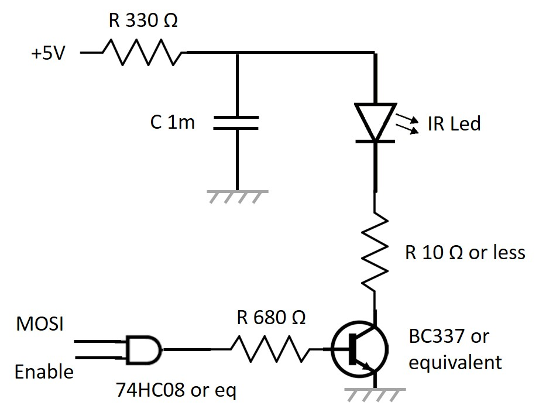

# LegoInfrared

Implementation of the Lego Infrared protocol using SPI. Implementation for both .NET IoT and .NET nanoFramework.

This project allow to control any Lego Power Function and support all Lego modes including exclusive modes which can't be done thru any of the Lego remote control.

## Documentation

For reference only, all copyrights to [Lego(c)](https://www.lego.com/), the infrared protocol specifications are included in this repository here for the [initial v1.0 version](./Assets/LEGO_Power_Functions_RC.pdf) and a [further v1.10 version](./Assets/LEGO_Power_Functions_RC_v110.pdf).

So far, this implementation is compatible with the v1.0. It is intended to add v1.10 support in a short future.

## Required electronic

The infrared module require a bit of electronic. You'll need a to drive enough power in the infrared led to be able to control trains or other Lego Power Functions in large rooms or with a lot of lights.

For this, you'll need to build the equivalent electronic:



* The MOSI pin is 19 and Enabled is pin number 24 on a Raspberry PI. Those are the 2 pins you need for the infrared part.
* On an ESP32, this is configurable, install the nanoFrameork.Hardware.Esp32 nuget and use the `Configuration.SetPinFunction()`

## Usage

You need first to create an instance of the LegoInfrared class:

```csharp
LegoInfrared _infrared;
// On an ESP32, setup first the pins for the SPI
Configuration.SetPinFunction(14, DeviceFunction.SPI1_CLOCK);
Configuration.SetPinFunction(12, DeviceFunction.SPI1_MISO);
Configuration.SetPinFunction(13, DeviceFunction.SPI1_MOSI);

// We will use chip select 17
_infrared = new LegoInfrared(1, 17);

_infrared.ComboMode(Speed.BlueForward, Speed.BlueForward, Channel.Channel1);

_infrared.SingleOutputContinuousAll(
    new Function[] { Function.Set, Function.Clear, Function.Toggle, Function.NoChange },
    new Output[] { Output.BluePinC2, Output.RedPinC2, Output.RedPinC1, Output.BluePinC1 });
```

And as shown in the example, you can then call any of the public function. You still need to understand what each function is doing.
